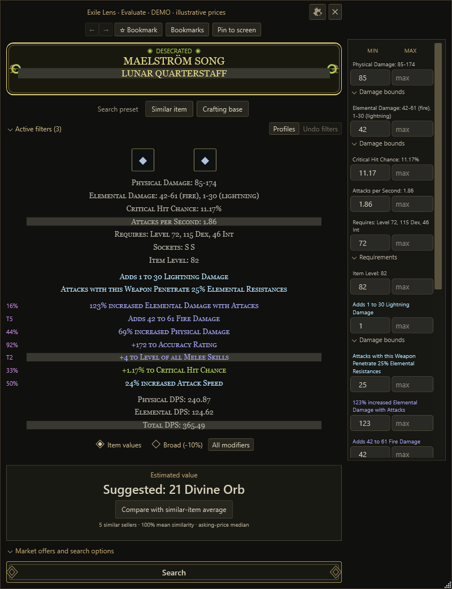
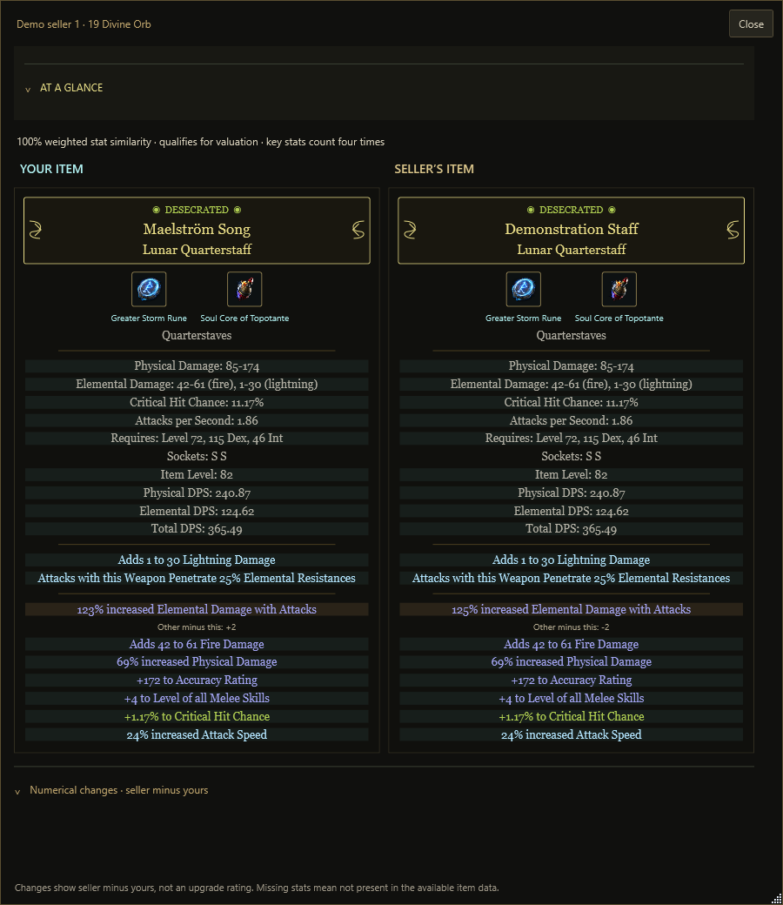
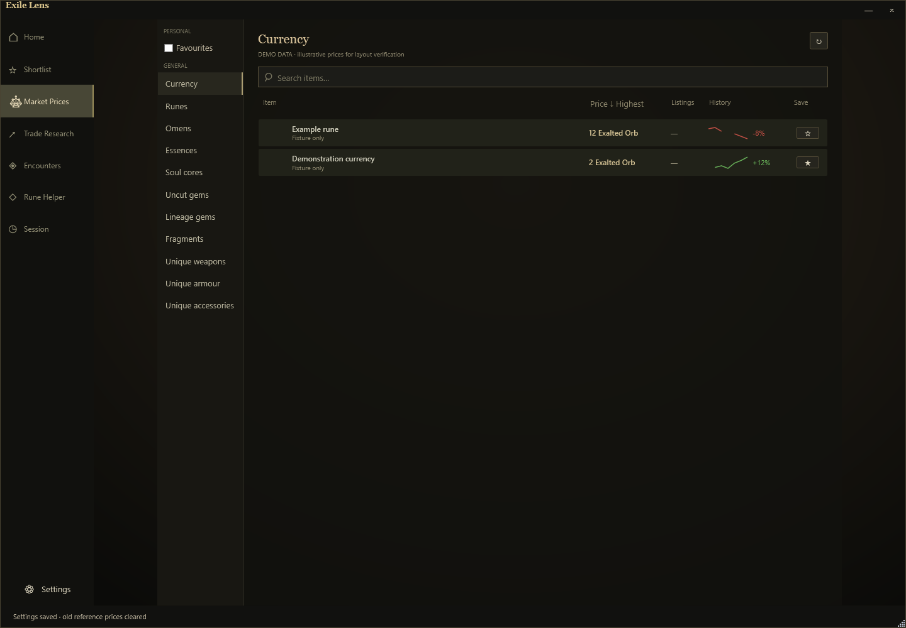

# ExileLens

A Windows companion for **Path of Exile 2**. Press **Alt+E** to inspect an item, find comparable offers, adjust search filters and compare seller items beside your own.

**[Download v0.4.0-beta.7](https://github.com/blacksheep25/ExileLens/releases/tag/v0.4.0-beta.7)** · Windows 10/11 x64 · MIT




*Screenshots show actual application controls with synthetic items, sellers and prices. They are demonstrations, not live market quotes. Rune artwork is loaded before capture.*

## Item checks and comparisons

- **Search your way:** start broad, choose suggested filters, select a base type or search as a crafting base. Edit min/max bounds directly, save profiles and undo changes. Select non-numeric modifiers such as “Upgrades Radius to Medium” without entering bounds. Broad matching preserves unscalable and discrete values.
- **Compare clearly:** labelled **Your item** and **Seller’s item** cards highlight matching stats, numerical differences and modifiers present on only one item.
- **See the trade-offs:** the collapsible **At a glance** section starts closed and defaults to **General**, using the actual numeric modifiers on both items. Rings include life, Spirit, rarity and resistances, with implicit and explicit rolls kept separate. Choose **Physical attacks**, **Elemental attacks**, **Spells** or **Defences** to narrow the comparison. Higher values appear green, lower values red, and equal or unavailable values grey. Gains, losses and a cautious verdict help you assess the displayed stats; they do not simulate your full build.
- **Understand estimates:** important stats receive more weight than secondary modifiers. Skill levels, additional arrows and weapon DPS retain strict checks. Each comparison explains its similarity or exclusion; estimates require at least three qualifying independent sellers.
- **Inspect more item types:** equipment, tablets and supported exchange items, plus quest-item descriptions with wiki links. Cards include DPS, modifier styling, socket artwork and explicit empty-socket indicators. Seller cards retain granted skills supplied by the trade response. Modified fixed rolls such as `+4(3)` use the actual value for searching, while keeping the reference value in metadata.
- **Keep useful items:** bookmarks, notes, recent-check navigation and screen pins.



## Market dashboard and in-game tools

- **Market Prices:** searchable categories, favourites, highest-price-first sorting, history tooltips and automatic refresh every five minutes while visible.
- **Readable currencies:** sub-Divine prices use Exalted Orbs when fresh rates are available. Exchange unit and stack prices keep the same currency; hover for source-price equivalents.
- **Rune Helper:** select a choice-name region and start local English OCR to display indicative prices beside recognised choices while POE2 is foreground.
- **Encounters and sessions:** encounter reward information, area history from Client.txt and optional manual loot recording.
- **Clear search progress:** listing page numbers and a live request-spacing countdown explain multi-page searches. Cached results avoid unnecessary catalogue requests; server cooldowns remain respected.
- **Application updates:** startup and manual GitHub release checks, optional automatic downloads, beta-channel selection, SHA-256 verification and **Update and restart**. The previous installation is retained, with rollback for detected installation/startup failures.
- **Desktop controls:** remembered window placement, configurable shortcuts, click-through and dismissal when clicking outside item evaluation.



## Getting started

1. Download the Windows x64 ZIP from [Releases](https://github.com/blacksheep25/ExileLens/releases). Extract every file and run `ExileLens.exe`. .NET is bundled; native Rune Helper OCR may require the Microsoft Visual C++ 2015–2022 x64 runtime.
2. Select your league in **Settings**. Choose your game's `logs/Client.txt` for area detection.
3. Run POE2 in windowed or borderless mode. Hover an item and press **Alt+E**.
4. Use **Ctrl+Alt+O** to show or hide the main panel. Open **Rune Helper** from the sidebar to configure rune recognition.

Exit the previous tray instance before upgrading. Settings remain in `%LOCALAPPDATA%\ExileLens`, outside the installation folder.

## Updating

Open **Settings → Application updates**. Startup checks are on, automatic downloads are off, and beta releases are included by default. Downloads do not interrupt play; installing requires **Update and restart**. Your settings and bookmarks remain in LocalAppData.

Users on beta.6 or earlier need to manually install beta.7 once to receive the updater. Updates need write access beside the installation and permission to run the local PowerShell helper. See [updater details and recovery](docs/UPDATER.md).

## Build from source

Requires Windows and the **.NET 8 SDK**. Run from the repository root:

```powershell
git clone https://github.com/blacksheep25/ExileLens.git
cd ExileLens
dotnet run --project src/ExileLens -c Release
```

Build and validate:

```powershell
dotnet run --project tests/ExileLens.Tests -c Release
dotnet publish src/ExileLens -c Release -r win-x64 --self-contained true -o artifacts/build
dotnet run --project src/ExileLens -c Release -- --smoke-test
```

Exit the running build before replacing it. Local builds reuse `artifacts/build`. UI smoke checks require a Windows desktop and generate fixture screenshots; they do not establish live-market accuracy or compatibility with every game/display setup.

## Data and limitations

ExileLens is a beta. Prices are **asking prices**, not completed sales or guaranteed values. Similarity uses a limited fetched sample. Missing rates, ambiguous sockets, unsupported modifiers and service availability can limit results. Green/red comparisons indicate higher/lower numbers; whether that improves your build depends on its mechanics. Missing source stats remain unknown rather than being treated as zero.

Trade searches send item/filter information to Path of Exile's trade website. Economy prices come from poe.ninja; artwork can load from official item-image hosts. Requests respect cooldowns, but rate limits and verification challenges can still prevent results.

Settings, item history, bookmarks, profiles and caches are stored locally. Rune captures are processed in memory and are not saved or uploaded during normal operation. Do not attach your LocalAppData folder to public bug reports.

English item text only. Character profiles are manually configured locally; account connection is not included. There is no automatic ground-loot pickup tracking or automated trading. Full parity with other overlays is not claimed.

## More information

- [Changelog](CHANGELOG.md)
- [Feature audit](docs/FEATURE_AUDIT.md)
- [Screenshot gallery](docs/SCREENSHOTS.md)
- [Release and validation process](docs/RELEASING.md)

Licensed under [MIT](LICENSE). See [third-party notices](THIRD_PARTY.md) for dependencies and data attribution. Path of Exile and its artwork belong to Grinding Gear Games; ExileLens is an independent community project.
