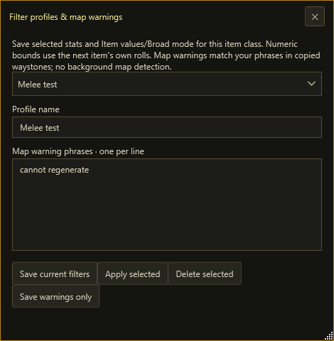
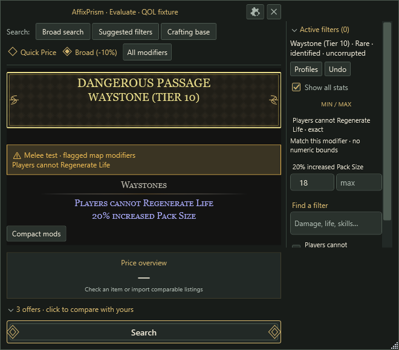
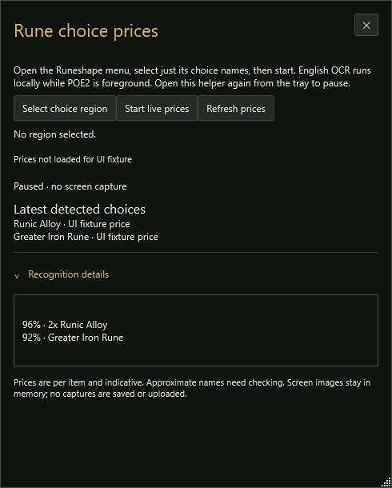
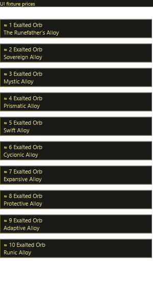

# Screenshot gallery

These are renders of actual ExileLens Windows controls from the included smoke/showcase workflow. All prices, seller accounts and warning profiles are synthetic demonstration fixtures. No screenshots of private desktops, chat or account data are included. Artwork is intentionally absent where the isolated fixture has no external icon URL.

## Item evaluation

Full weapon properties, typed modifiers, DPS, optional suggested filters, a separate min/max panel, bookmarks/pinning and an indicative similar-item estimate.

## Seller comparison

Your item beside a synthetic seller item, with inline card differences. At a glance starts collapsed; expand it for a General stat comparison or a focused priority.

## Reusable filters

Save selected modifiers for an item class; the next item's own rolls supply the bounds. Warning phrases are configured here too.

## Waystone warnings

A copied waystone highlights a phrase from the active profile. This is an opt-in copied-item check, not automatic map detection.

## Rune choice helper

The helper exposes recognition details and local scan controls. The separate annotation window places cached price labels beside recognised choice names. These example prices are deliberately synthetic.

## Regeneration

From the repository root on a Windows desktop, run `dotnet run --project src/ExileLens -c Release -- --smoke-test`. Main showcase files appear in `artifacts/showcase`; the other captures are under `artifacts`. Curated copies live in this folder's `screenshots` directory. Review new captures before replacing the published images.
